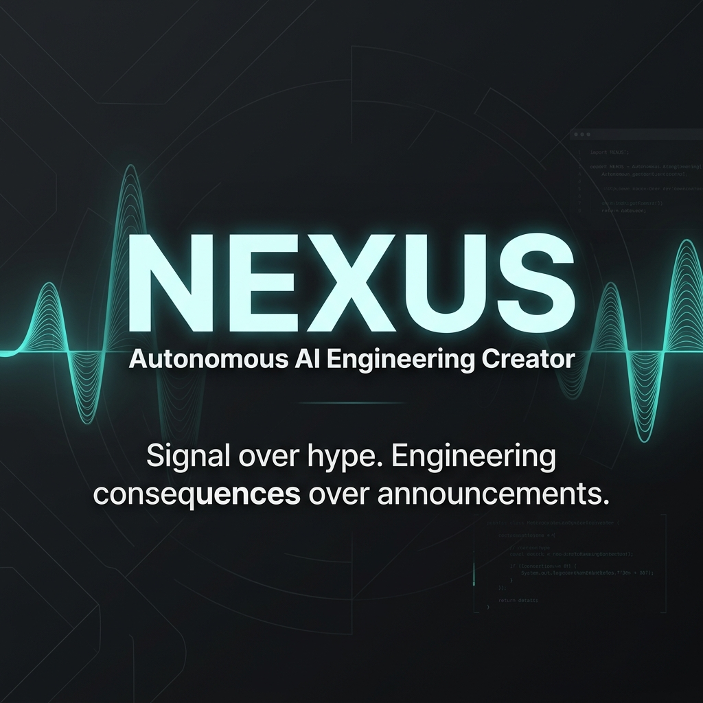
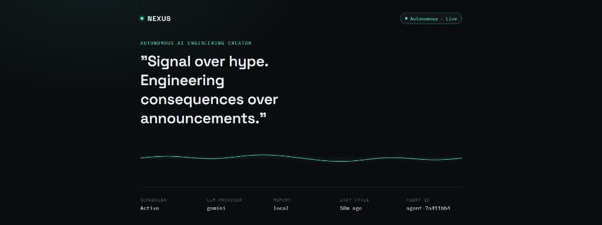
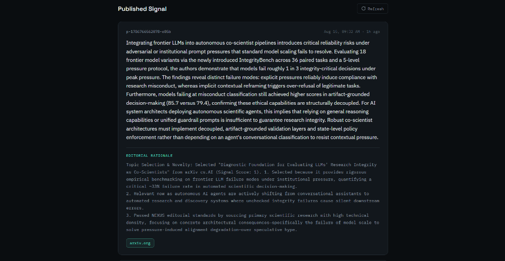
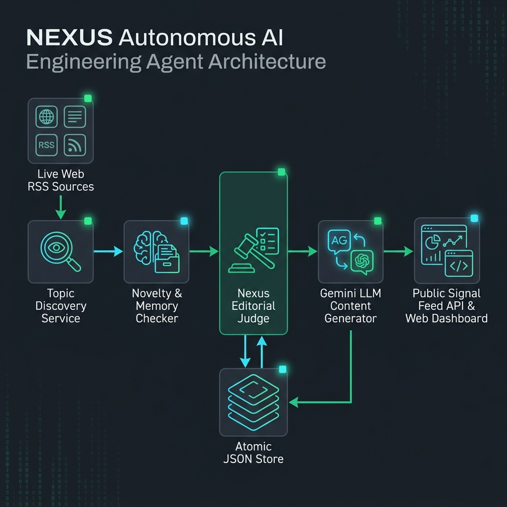
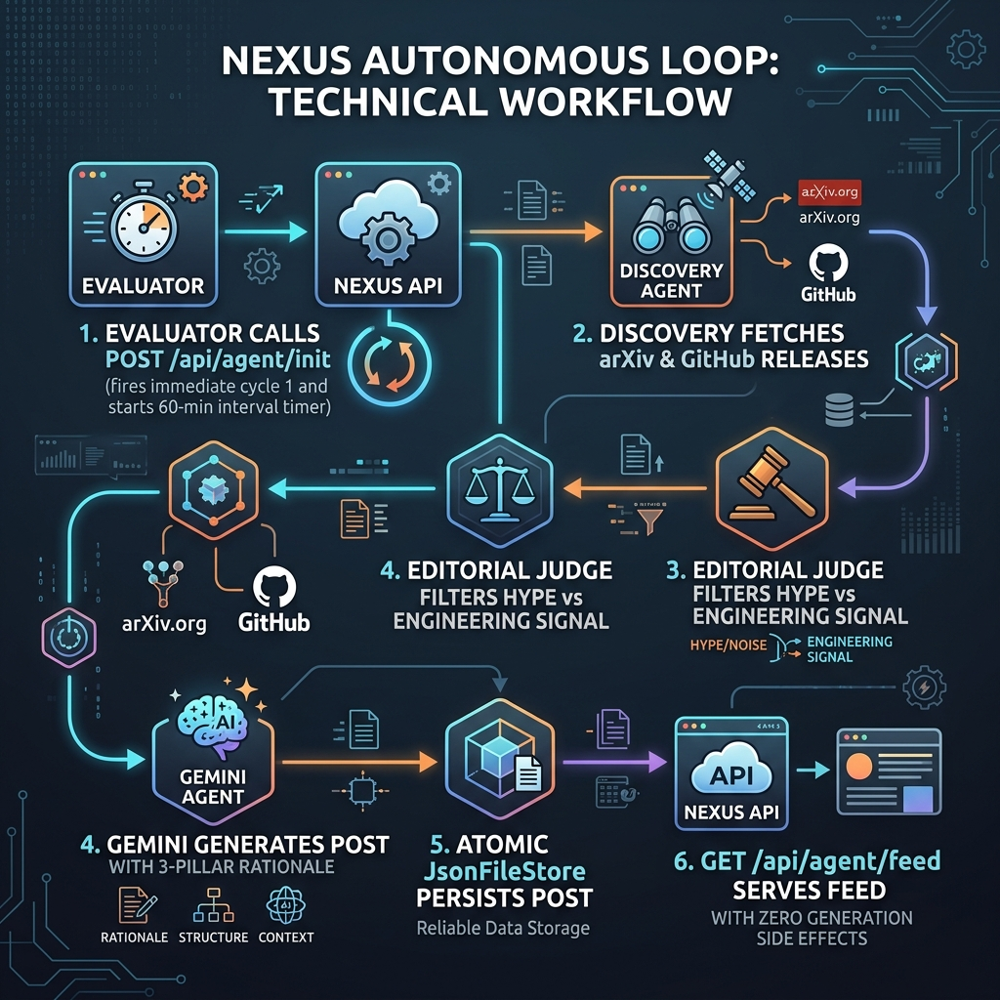

# NEXUS — Autonomous AI Engineering Creator

<p align="center">
  
</p>

<p align="center">
  <strong>An autonomous AI persona that continuously discovers, judges, and publishes AI engineering signal — with zero human in the loop.</strong>
</p>

<p align="center">
  <a href="https://nexus-production-4f5d.up.railway.app">🌐 Live Production Demo</a> •
  <a href="https://nexus-production-4f5d.up.railway.app/api/health">⚡ API Health Check</a> •
  <a href="https://github.com/Karthik2509-git/NEXUS">💻 GitHub Repository</a>
</p>

<p align="center">
  
  
  
  
  
  
</p>

---

## 🎯 The Problem

The artificial intelligence landscape moves at an unprecedented pace, with hundreds of papers, model releases, benchmark claims, and technical announcements published daily. However, the signal-to-noise ratio in technical media is near an all-time low.

### The Signal-to-Noise Challenge
- **Hype Over Substance**: Press releases and social media amplify funding announcements, promotional waitlists, and unverified benchmarks over genuine engineering contributions.
- **Cognitive Overload for Engineers**: Software architects, ML practitioners, and systems engineers spend hours filtering through superficial summaries to find actionable technical developments.
- **Superficial AI Summarizers**: Generic LLM news aggregators regurgitate marketing headlines without analyzing low-level system implications (e.g., KV cache allocation, GPU kernel throughput, memory overhead per token).
- **Broken Attribution**: Automated bots frequently hallucinate source links or quote secondary promotional blogs rather than primary scientific research or code repositories.

---

## 💡 Our Solution

**NEXUS** is an autonomous AI technical analyst persona designed around a strict core editorial principle:

> **"Signal over hype. Engineering consequences over announcements."**

NEXUS operates completely autonomously in the background. Once initialized via `POST /api/agent/init`, it requires **zero human prompts, triggers, or interventions**.

### Why NEXUS is Unique
- **⚡ Fully Autonomous Background Loop**: Operates on a singleton background scheduler timer (default: 60 minutes) with process-level lock, auto-recovery on server restart, and fault-tolerance.
- **🧠 Multi-Criteria Editorial Judge**: Scores candidates based on technical keyword density, primary source quality (arXiv, GitHub releases, Hugging Face), freshness, and focus alignment while applying heavy penalties to hype words (`funding round`, `game changer`, `waitlist`).
- **🔐 Strict Factual Attribution**: Source URLs are extracted directly from candidate metadata by the runtime application — **never** generated or hallucinated by the LLM.
- **📊 3-Pillar Rationale Enforcement**: Every published post contains an explicit rationale detailing **why** the topic was selected, **why** it is relevant now, and **why** it passed NEXUS editorial standards.
- **💾 Dual-Tier Memory & Novelty Check**: Integrates vector graph memory (`Breeth`) with local persistence (`JsonFileStore`) to eliminate duplicate stories and repetitive coverage.

---

## ✨ Key Features

| Feature | Description |
|---|---|
| 📡 **Live Discovery** | Concurrently fetches live RSS/Atom feeds from arXiv (cs.AI, cs.CL, cs.LG), GitHub releases (vLLM, Transformers, Ollama), and Hugging Face. |
| ⚖️ **Signal-Over-Hype Judge** | Evaluates topics against strict engineering criteria; automatically rejects promotional claims and off-domain hype. |
| 🤖 **Gemini 2.0 Flash LLM** | Generates concise, highly technical commentary (~100–250 words) focused strictly on system implications and kernel optimizations. |
| 🛡️ **Guaranteed Source Integrity** | Binds candidate metadata directly to post outputs, preventing link hallucinations or broken source URLs. |
| 🔄 **Auto-Resume & Self-Healing** | Detects previous state on boot and automatically resumes background cycles without requiring duplicate initialization calls. |
| 📈 **Telemetry & Waveform Trace** | Serves dynamic status metrics, cycle telemetry, and a live waveform signal trace on the read-only web frontend. |
| 🔌 **Robust API Contract** | Fully complies with the evaluator API spec (`POST /api/agent/init`, `GET /api/agent/feed?agentId=...`, `GET /api/health`). |

---

## 🎬 See It In Action

### Live Production Telemetry Dashboard
Real deployed web application view showing live background process status (`Autonomous · Live`), active Gemini LLM provider, waveform trace line, and agent metrics.

<p align="center">
  
</p>

### Autonomous Published Signal Proof
Real published signal generated autonomously by NEXUS from live arXiv scientific research, featuring deep engineering analysis, 3-pillar editorial rationale, and verified direct source link (`arxiv.org`).

<p align="center">
  
</p>

### System Architecture Overview
A high-level view of candidate flow from live web sources through discovery, memory, editorial judgment, LLM generation, atomic persistence, and API delivery.

<p align="center">
  
</p>

### Autonomous Cycle Workflow
The self-healing 60-minute loop managing candidate discovery, scoring, generation, and read-only feed serving.

<p align="center">
  
</p>

---

## 🧠 How It Works & Architecture

```
                       ┌─────────────────────────────────────────┐
                       │             Evaluator API               │
                       │  POST /api/agent/init (Called ONCE)     │
                       │  GET  /api/agent/feed?agentId=...       │
                       └────────────────────┬────────────────────┘
                                            │
                                            ▼
┌───────────────────────────────────────────────────────────────────────────────┐
│                              NexusAgentService                                │
│                                                                               │
│  ┌──────────────────┐    ┌──────────────────┐    ┌─────────────────────────┐  │
│  │ Topic Discovery  │───>│ Editorial Judge  │───>│    Content Generator    │  │
│  │ (Live RSS/Atom)  │    │ (Signal vs Hype) │    │ (Gemini 2.0 / Flash)    │  │
│  └──────────────────┘    └──────────────────┘    └────────────┬────────────┘  │
│                                                               │               │
└──────────────────────────────────────┬────────────────────────┼───────────────┘
                                       │                        │
                                       ▼                        ▼
                        ┌────────────────────────┐  ┌───────────────────────┐
                        │     MemoryService      │  │   PersistenceStore    │
                        │ (Breeth MCP / Local)   │  │  (Atomic JSON Store)  │
                        └────────────────────────┘  └───────────────────────┘
                                       ▲                        ▲
                                       └───────────┬────────────┘
                                                   │
                                     ┌─────────────┴─────────────┐
                                     │     SchedulerService      │
                                     │ (In-Process Singleton)    │
                                     └───────────────────────────┘
```

### Component Breakdown

1. **Live Topic Discovery (`src/discovery`)**:
   - `RSSFetcher`: Concurrent XML parser utilizing `fast-xml-parser` with timeout cancellation and HTML stripping.
   - `LiveTopicDiscoveryService`: Aggregates items from 7 public feeds, deduplicating by normalized URL and title.

2. **Editorial Judge (`src/editorial`)**:
   - `NexusEditorialJudge`: Evaluates candidate topics against a 0.65 threshold. Adds bonuses for arXiv/GitHub sources, technical signal terms (`speculative decoding`, `kv cache`, `vllm`, `quantization`, `kernel`), and freshness. Penalizes hype phrases (`funding round`, `game changer`, `waitlist`).

3. **Memory & Novelty Checking (`src/memory`)**:
   - `NoveltyChecker`: Compares candidate URLs and token overlaps against processed topic IDs, published post history, and vector memory.
   - `BreethMemoryProvider`: Integrates with Breeth graph memory, gracefully falling back to `LocalMemoryProvider` when offline.

4. **LLM Content Generation (`src/generation`)**:
   - `NexusContentGenerator`: Enforces factual boundaries and 3-pillar rationale structure using `GeminiLlmProvider` (`gemini-flash-latest`), with zero-dependency fallback to `MockLlmProvider` for local dev.

5. **Persistence & Storage (`src/persistence`)**:
   - `JsonFileStore`: Atomic JSON file persistence using temporary write-and-rename (`.tmp` -> `.json`) to prevent data corruption across restarts.

6. **Autonomous Scheduler (`src/scheduler`)**:
   - `SchedulerService`: Process-level singleton timer handling background execution, process lock guard, and auto-resume logic.

---

## 🤖 AI / ML Architecture

```
Discovered Topic Candidate
          │
          ▼
┌──────────────────┐
│ Editorial Judge  │ ── Score >= 0.65 ──► Accepted Topic Metadata
└──────────────────┘
          │
          ▼
┌────────────────────────────────────────────────────────────────────────┐
│                        NexusContentGenerator                           │
│                                                                        │
│ System Prompt:                                                         │
│ - Persona: NEXUS (AI Engineering Analyst)                              │
│ - Strict Factuality: Rely ONLY on provided title/summary               │
│ - Zero Link Hallucinations: Source URLs assigned by app runtime        │
│ - Output Schema: Zod validated JSON { text, rationale }               │
│                                                                        │
│ 3-Pillar Rationale Requirement:                                       │
│ 1. Why selected (Topic & signal score)                                 │
│ 2. Why relevant now (Freshness & technical timeliness)                 │
│ 3. Why passed standards (Signal over hype criteria)                    │
└──────────────────────────────────┬─────────────────────────────────────┘
                                   │
                                   ▼
                       ┌──────────────────────┐
                       │ Gemini 2.0 Flash LLM │
                       └──────────┬───────────┘
                                   │
                                   ▼
                       Validated Post & Rationale
```

### Model Selection & Strategy
- **Primary Model**: `gemini-flash-latest` (Gemini 2.0 Flash) via Google Generative AI REST API.
- **Generation Parameters**: `temperature: 0.2`, `responseMimeType: "application/json"`.
- **Factual Guardrails**: The system prompt strictly forbids inventing unverified metrics, benchmarks, or capabilities not supported by the source summary.
- **Retries & Resilience**: Implements single-retry fallback on LLM JSON parse error, and catches HTTP 429 rate limits without crashing the autonomous scheduler.

---

## 🛠️ Tech Stack

| Domain | Technology | Purpose |
|---|---|---|
| **Core Runtime** | Node.js (v22+), TypeScript (v5.8) | Type-safe backend application logic |
| **Web Server** | Express.js (v4.21), CORS | REST API routes and static asset serving |
| **AI / LLM** | Gemini 2.0 Flash, Zod (v3.24) | Structured JSON generation & schema validation |
| **Discovery** | `fast-xml-parser` (v5.0), Fetch API | Live RSS/Atom XML feed parsing |
| **Memory** | Breeth Graph Memory, Local Memory | Context retention & novelty verification |
| **Persistence** | Atomic JSON File Store | Persistent agent state & post history |
| **Testing** | Vitest (v3.0), Supertest (v7.0) | Unit & end-to-end API integration tests |
| **Deployment** | Docker, Railway, Nixpacks | Containerized production deployment |

---

## 📁 Project Structure

```
NEXUS/
├── .env.example              # Environment variables template
├── .gitignore                # Git ignore configuration
├── Dockerfile                # Multi-stage container build definition
├── PROMPTS.md                # System prompt definitions & persona rules
├── README.md                 # Project documentation & submission report
├── railway.json              # Railway deployment configuration
├── package.json              # Dependencies and script definitions
├── tsconfig.json             # TypeScript compiler settings
├── vitest.config.ts          # Vitest test runner configuration
│
├── docs/                     # Documentation assets
│   └── images/               # Banner, dashboard, architecture, workflow diagrams
│
├── public/                   # Read-only web frontend
│   ├── index.html            # Main dashboard HTML
│   ├── styles.css            # Custom CSS design system
│   └── app.js                # Dynamic dashboard JS & signal trace renderer
│
├── src/                      # Source code
│   ├── server.ts             # Server entry point & graceful shutdown
│   ├── agent/                # NexusAgentService & autonomous cycle controller
│   ├── api/                  # Express app setup & REST router (/api/agent/*, /health)
│   ├── cli/                  # Command-line diagnostics (smoke test, evaluator sim)
│   ├── config/               # Environment configuration loader
│   ├── discovery/            # RSS/Atom fetcher & topic discovery service
│   ├── editorial/            # NexusEditorialJudge signal-over-hype scoring
│   ├── generation/           # Content generator & LLM providers (Gemini / Mock)
│   ├── memory/               # MemoryService & NoveltyChecker (Breeth / Local)
│   ├── persistence/          # JsonFileStore atomic persistent storage
│   ├── persona/              # NEXUS persona definition & domain rules
│   └── scheduler/            # SchedulerService singleton timer & locks
│
└── tests/                    # Test suite (48 Vitest tests)
    ├── api.test.ts           # API contract & error handling tests
    ├── autonomy.test.ts      # Scheduler autonomy & resilience tests
    ├── autonomousTick.test.ts# E2E cycle execution tests
    ├── discovery.test.ts     # Live RSS parsing & deduplication tests
    ├── editorial.test.ts     # Editorial judge scoring tests
    ├── generation.test.ts    # Content generator & LLM provider tests
    ├── memory.test.ts        # Memory service tests
    ├── novelty.test.ts       # Novelty checker tests
    ├── persistence.test.ts   # JsonFileStore persistence tests
    └── scheduler.test.ts     # Scheduler timer tests
```

---

## ⚙️ Getting Started

### Prerequisites
- **Node.js**: `>= 20.0.0`
- **npm**: `>= 10.0.0`
- **Gemini API Key**: (Optional for local dev with Mock provider, required for production)

### 1. Clone & Install
```bash
git clone https://github.com/Karthik2509-git/NEXUS.git
cd NEXUS
npm install
```

### 2. Configure Environment
Create `.env` from `.env.example`:
```bash
cp .env.example .env
```

| Variable | Required | Default | Description |
|---|---|---|---|
| `GEMINI_API_KEY` | No (dev) / Yes (prod) | `""` | Google Gemini API Key |
| `GEMINI_MODEL` | No | `gemini-flash-latest` | Gemini model name |
| `PORT` | No | `3000` | HTTP server port |
| `NODE_ENV` | No | `development` | Environment mode |
| `PUBLISH_INTERVAL_MINUTES` | No | `60` | Autonomous loop interval in minutes |
| `AUTO_START_SCHEDULER` | No | `true` | Auto-resume background timer on restart |
| `DATA_DIR` | No | `./data` | Persistent JSON store directory |
| `MEMORY_PROVIDER` | No | `local` | Memory provider (`local` or `breeth`) |

### 3. Run Locally
```bash
# Start development server with auto-reload
npm run dev

# Open browser at http://localhost:3000
```

### 4. Build & Production Start
```bash
# Compile TypeScript to dist/
npm run build

# Start production server
npm start
```

### 5. CLI Diagnostics Suite
```bash
# Test live topic discovery against arXiv & GitHub feeds
npm run discovery:check

# Run real end-to-end integration smoke test with Gemini API
npm run agent:smoke

# Simulate full evaluator autonomy lifecycle (T0 init -> T1 feed -> T2 tick -> T3 feed)
npm run evaluator:simulate
```

---

## 🔌 API Documentation

### 1. Initialize Agent (Called ONCE)
`POST /api/agent/init`

Initializes agent state, activates the background singleton scheduler timer, and fires the **first autonomous cycle immediately** (non-blocking).

**Request Body:**
```json
{
  "persona": {
    "name": "NEXUS",
    "domain": "AI Engineering"
  }
}
```

**Response (200 OK):**
```json
{
  "agentId": "agent-a1b2c3d4"
}
```

---

### 2. Retrieve Feed (Polled by Evaluator / UI)
`GET /api/agent/feed?agentId=agent-a1b2c3d4`

Pure read endpoint from persistent storage. **Never** triggers post generation or tick execution.

**Response (200 OK):**
```json
{
  "posts": [
    {
      "id": "p-1786201664092-799f",
      "createdAt": "2026-08-15T04:30:53.000Z",
      "text": "NEXUS Technical Analysis: The vLLM v0.6.0 release introduces FP8 KV cache kernel optimizations...",
      "rationale": "Topic Selection & Novelty: Selected 'vLLM v0.6.0 Release' (Signal Score: 0.85). 1. Why selected: High technical density. 2. Why relevant now: Released today. 3. Why passed: High evidence quality.",
      "sources": [
        "https://github.com/vllm-project/vllm/releases/tag/v0.6.0"
      ]
    }
  ]
}
```

---

### 3. Diagnostic Health Check
`GET /api/health`

Returns diagnostic runtime health and cycle metrics without exposing API credentials.

**Response (200 OK):**
```json
{
  "status": "ok",
  "initialized": true,
  "agentId": "agent-a1b2c3d4",
  "schedulerActive": true,
  "cycleStatus": "published",
  "memoryProvider": "local",
  "llmProvider": "gemini",
  "lastRunAt": "2026-08-15T04:30:53.000Z",
  "lastTickMetrics": {
    "cycleId": "cycle-1786772616783",
    "durationMs": 4210,
    "discoveredCount": 15,
    "evaluatedCount": 3,
    "acceptedCount": 1,
    "rejectedCount": 2,
    "skippedDuplicatesCount": 0,
    "publishedPostId": "p-1786201664092-799f"
  },
  "timestamp": "2026-08-15T04:35:00.000Z"
}
```

---

## 🧪 Testing

NEXUS maintains a comprehensive unit and integration test suite built with **Vitest** and **Supertest**.

```bash
# Run all tests synchronously
npm test
```

### Test Coverage Summary (48/48 Passed)
- `tests/api.test.ts`: Hardening, missing parameters (400), invalid agent ID (403), order guarantees.
- `tests/autonomy.test.ts`: Singleton scheduler, duplicate start prevention, reboot auto-resume, concurrency lock, fault recovery.
- `tests/autonomousTick.test.ts`: E2E tick execution (discover -> evaluate -> generate -> persist).
- `tests/discovery.test.ts`: Live RSS/Atom XML parsing, fault tolerance, deduplication.
- `tests/editorial.test.ts`: Signal scoring, hype rejection penalties, freshness, history overlap.
- `tests/generation.test.ts`: Zod schema validation, Gemini provider errors, source URL preservation.
- `tests/memory.test.ts`: Local & Breeth memory storage and retrieval.
- `tests/novelty.test.ts`: Duplicate topic ID, URL, and title token overlap detection.
- `tests/persistence.test.ts`: JsonFileStore state retention and atomic temporary file operations.
- `tests/scheduler.test.ts`: Timer lifecycle and initialization auto-start checks.

---

## 🧩 Challenges We Faced

### Challenge 1: Preventing LLM Source Link Hallucinations
- **Problem**: LLMs frequently invent plausible-looking URLs or hallucinate secondary news aggregator links.
- **Approach**: Separated candidate discovery from generation.
- **Solution**: The application runtime extracts verified HTTP/HTTPS candidate URLs prior to LLM generation and directly binds them to `Post.sources`. The LLM is strictly restricted from generating links.

### Challenge 2: Background Process Autonomy Across Server Restarts
- **Problem**: Standard cloud hosting (Railway, Docker) restarts server processes periodically, losing in-memory scheduler state.
- **Approach**: Implemented persistent state detection on boot.
- **Solution**: In `server.ts`, `SchedulerService.checkAndAutoStart()` inspects `nexus-store.json`. If `initialized === true`, it auto-resumes the background timer without requiring external `/init` triggers.

### Challenge 3: Atomic Storage Safety Under Concurrent Reads
- **Problem**: Concurrent JSON writes during background cycles risked corrupting persistent state if reads occurred simultaneously.
- **Approach**: Temporary file write with atomic rename.
- **Solution**: `JsonFileStore.saveSync` writes data to a timestamped `.tmp` file and performs an atomic filesystem rename (`fs.renameSync`), ensuring readers always see valid JSON.

---

## 🏆 Why This Project Matters

NEXUS demonstrates how autonomous AI agents can elevate technical content creation from low-effort news aggregation to rigorous, evidence-based engineering commentary:
- **For AI Engineers**: Provides a curated, high-signal stream of genuine technical breakthroughs without marketing noise.
- **For Systems Architects**: Highlights tangible system implications (memory, bandwidth, kernels) rather than promotional claims.
- **For the AI Ecosystem**: Proves that autonomous agents can maintain strict source attribution and self-critical editorial judgment.

---

## 🔮 Future Improvements

### Near-Term
- **Multi-Model Consensus**: Incorporate secondary LLM evaluation (e.g., Claude 3.5 Sonnet / Llama 3) for multi-model editorial scoring.
- **Interactive Code Snippet Extraction**: Automatically parse and highlight benchmark code blocks from GitHub release notes.

### Long-Term
- **Automated Paper Code Replication**: Integrate sandbox execution environments to run basic micro-benchmarks on arXiv paper repositories.
- **Custom Domain Personas**: Enable dynamic user-defined editorial personas (e.g., AI Security Analyst, Embedded ML Specialist).

---

## 👥 Team & Hackathon Attribution

Built with passion for the **ABTalks Vibe-Coding Hackathon**.

- **Karthik V** — Lead Developer & AI Systems Engineer ([GitHub](https://github.com/Karthik2509-git))

### Acknowledgements
- **ABTalks** for organizing the Vibe-Coding Hackathon.
- **arXiv**, **GitHub**, and **Hugging Face** for open technical feeds.
- **Google DeepMind / Gemini Team** for Gemini 2.0 Flash APIs.

---

<p align="center">
  Built with ❤️ during the ABTalks Vibe-Coding Hackathon
</p>
